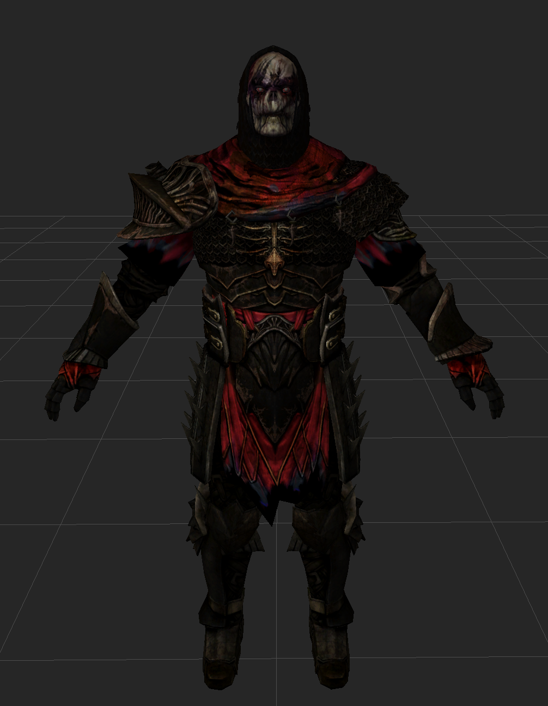
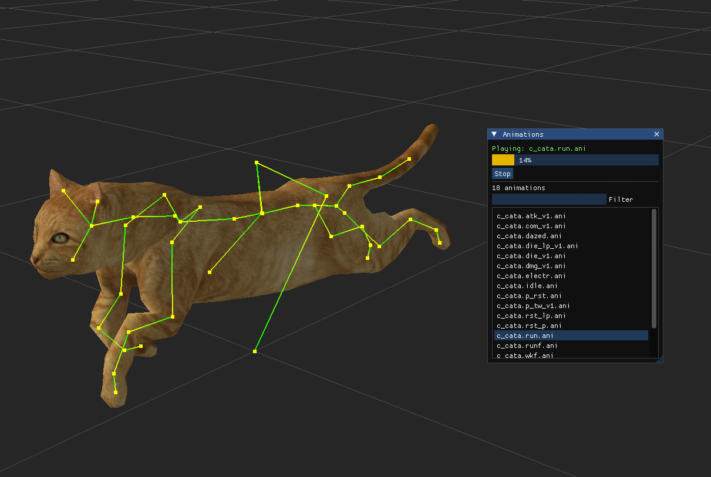
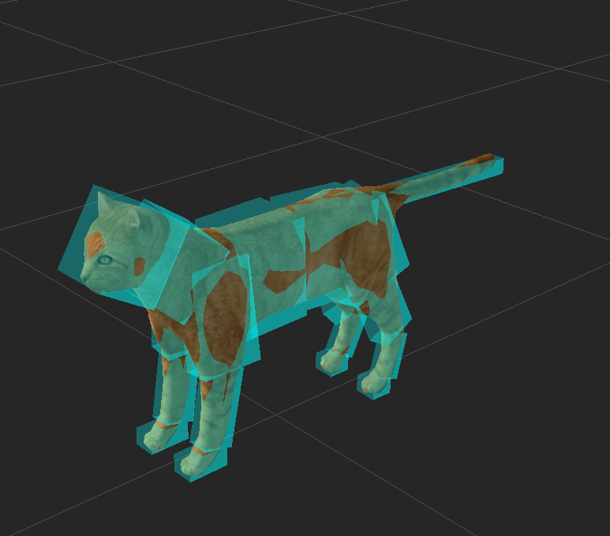
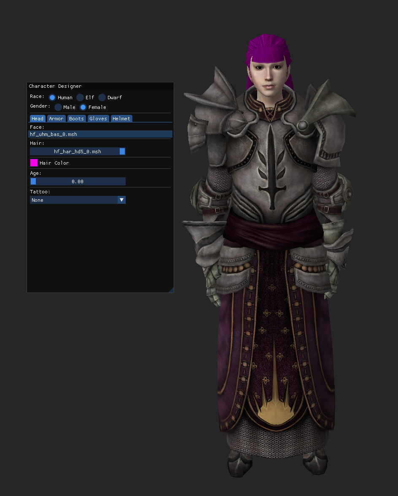

Initial Release of Haven Tools

Features include: 

1. Complete model browser (go to modelmeshdata.erf)
- Preview models, textures, collision, animations, materials, skeleton, etc.

2. Character designer
- Design a character and dress them up. This is heavily WIP and buggy. 

3. Export models as GLB
- Export models with their animations from either the browser or character designer. Allows easy import to blender or other application. Great for 3d printing
- NOTE: Exporting from the character designer will export a model at ~300mb and can be slow due to it processing over 1000 animations. This is WIP and will be changed later.

4. Dump the contents of the .erf files quickly and easily.

5. Listen, convert and extract audio files

5. You do not need to dump anything to preview the models.

Usage: 

Browse to your DAO installation and select the .exe. 

Explore without bloating your pc with a bunch of files, preview, and export as you wish! 
